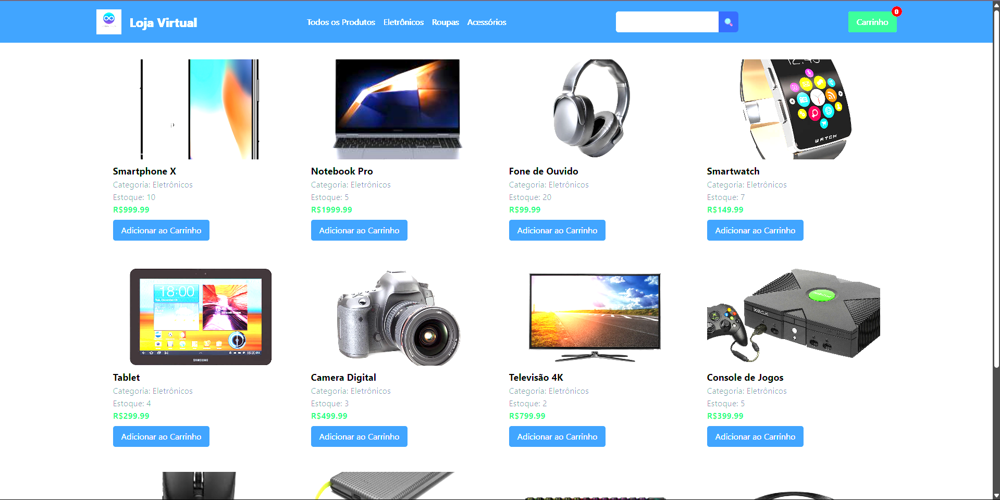
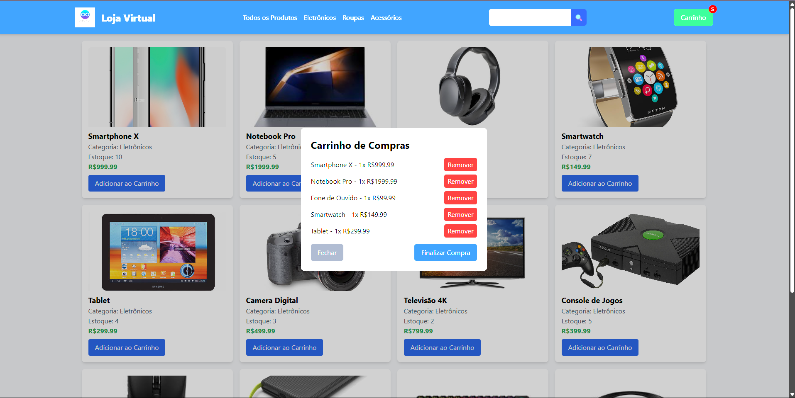
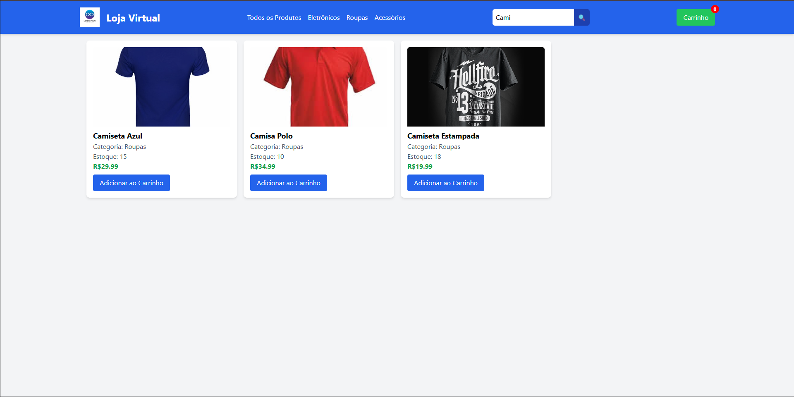
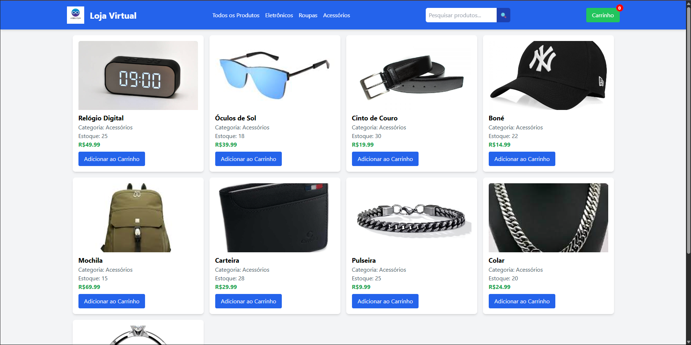

# 🛒 Loja Virtual

## 📄 Descrição do Projeto

A **Loja Virtual** é um projeto de uma loja online desenvolvida com tecnologias web simples, permitindo que usuários visualizem produtos, adicionem itens ao carrinho, filtrem por categorias e realizem pesquisas. 

O projeto foi criado para ser funcional e fácil de entender, usando apenas **HTML**, **CSS (com Tailwind)** e **JavaScript puro**, sem frameworks complexos ou bancos de dados. Ele contém 30 produtos divididos em três categorias (Eletrônicos, Roupas e Acessórios) e oferece uma experiência completa de e-commerce.

---

## ✅ Funcionalidades

- **Lista de Produtos**: 30 produtos com ID, nome, categoria, estoque, preço e imagem (opcional, com placeholders quando não especificada).
- **Exibição em Cards**: Produtos são mostrados na página inicial em formato de cards, com imagem, nome, categoria, estoque e preço.
- **Cabeçalho**: Inclui um logo, menu com links para todas as categorias (Eletrônicos, Roupas, Acessórios) e todos os produtos, além de um formulário de pesquisa.
- **Carrinho de Compras**: Permite adicionar vários produtos ao carrinho, respeitando o limite de estoque, com um modal para visualizar e remover itens.
- **Finalizar Compra**: Limpa o carrinho ao finalizar a compra e atualiza o estoque dos produtos, permitindo novas compras.
- **Controle de Estoque**: Produtos sem estoque têm o botão "Adicionar ao Carrinho" desativado e exibem um alerta se o usuário tentar adicioná-los.
- **Páginas de Categoria**: Páginas específicas para cada categoria, mostrando apenas os produtos correspondentes.
- **Pesquisa de Produtos**: Busca por termos ou letras no nome ou categoria dos produtos (ex.: "camisa" mostra camisas, "A" mostra produtos com "A").

---

## 🛠 Tecnologias Utilizadas

- **HTML**: Estrutura das páginas (`index.html` e `category.html`)
- **CSS (Tailwind)**: Estilização moderna e responsiva
- **JavaScript Puro**: Lógica para produtos, carrinho, pesquisa e filtros
- **localStorage**: Armazena o carrinho entre sessões

### Restrições respeitadas:
- Sem frameworks (Angular, React, Vue, jQuery)
- Sem banco de dados (produtos armazenados em array no `script.js`)

---

## ▶️ Como Executar o Projeto

### 🔧 Pré-requisitos

- Um navegador moderno (Chrome, Firefox, Edge, etc.)
- Um servidor local para carregar imagens corretamente, como:

#### Opções:
- **Node.js**: `npx http-server`
- **Live Server (VS Code)**: Recomendada
- **(Evite Python)**

---

## 📁 Estrutura do Projeto

```
loja-virtual/
├── img/                  # Imagens dos produtos e logo
│   ├── logo.png         # Logo da loja (personalizável)
│   ├── iphonex.jpg      # Exemplo de imagem de produto
│   └── ...              # Outras imagens (opcional)
├── index.html           # Página principal com todos os produtos
├── category.html        # Página para exibir produtos por categoria
└── script.js            # Lógica da loja (produtos, carrinho, pesquisa)
```

---

## 🚀 Passos para Executar

1. **Baixe o projeto**  
   Faça o download ou clone os arquivos para uma pasta no seu computador.

2. **Configure as imagens (opcional)**  
   - Adicione imagens dos produtos na pasta `img/` (ex.: `img/iphonex.jpg`).
   - No `script.js`, no array `products`, adicione o campo `image` com o caminho correto.
   - Para o logo, edite o `` nos arquivos `index.html` e `category.html`.

3. **Inicie um servidor local**  

   ### Recomendado (VS Code):
   - Instale a extensão **Live Server**
   - Clique com o botão direito em `index.html` > **Open with Live Server**

   ### Alternativa (Node.js):
   ```bash
   npx http-server
   ```

4. **Abra o navegador**
   - Acesse: `http://localhost:8080` (ou a porta exibida no terminal)

5. **Teste a loja**
   - Navegue pela página principal
   - Clique nas categorias (ex.: `category.html?cat=Eletrônicos`)
   - Adicione itens ao carrinho, finalize compras e pesquise por termos

---

### Tela Principal


### Carrinho de Compras


### Formulário de Pesquisa


### Categorias

